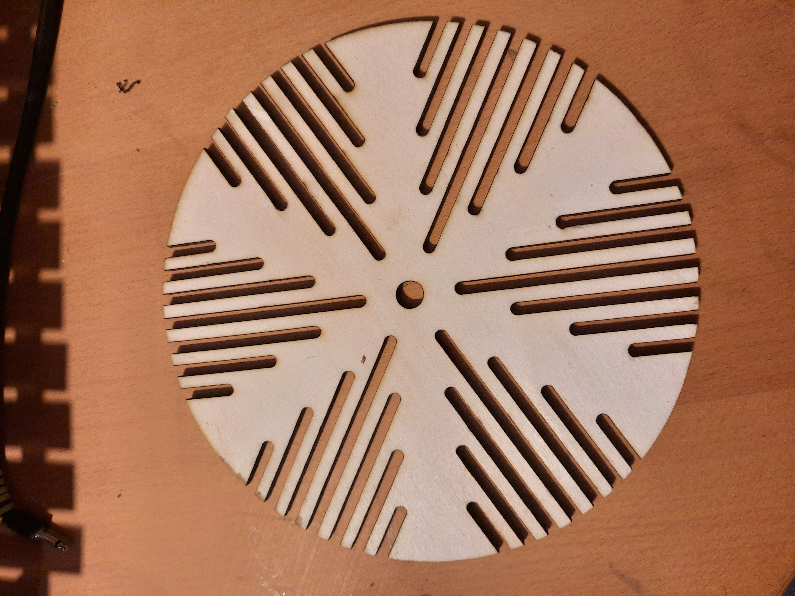
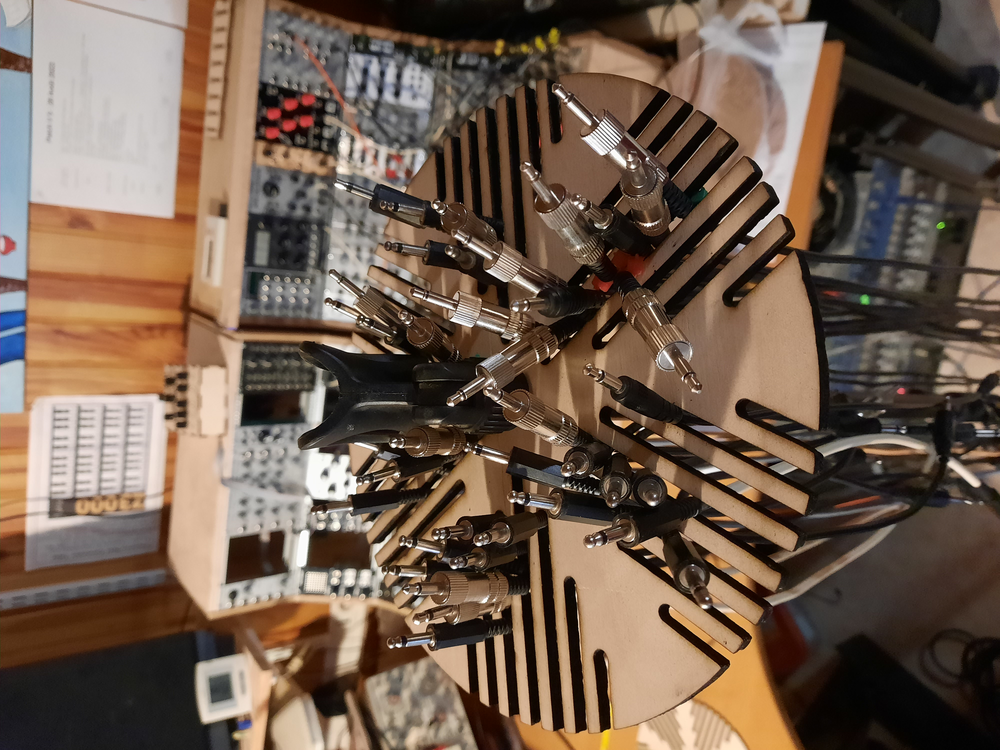
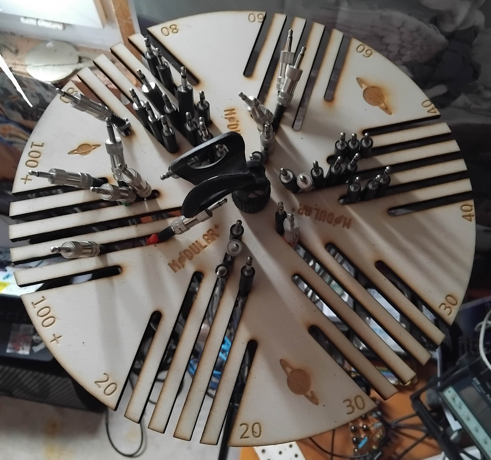
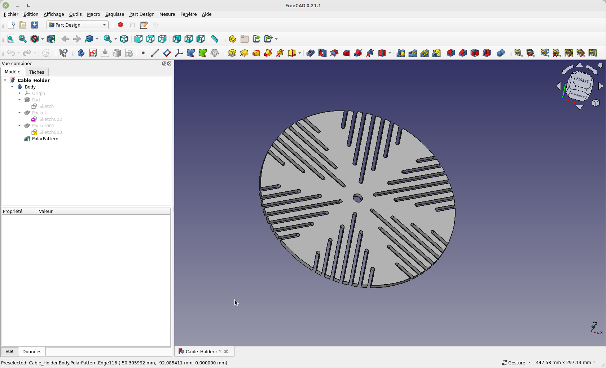

# Cable_Holder

How to store your eurorack cables on a microphone stand.
Just remove the clamp, install the stand and tighten it with the clamp.

Show you the project with the lasercutted poplar plywood 5 mm thickness

Here the first version

After some time in use, I realized that the support could accommodate more cable.

But adding grooves makes the bracket more flexible, so I opted for a larger diameter with fewer grooves, as this adds rigidity.

I also added some logos, because I like Saturn :) and for fun I added the length of the cables on either side of the grooves.

Here the second version

# Pictures

The pictures of version 1 in situation

Here the version 2 in situation

# Files

You could find here 3 differents formats.

Freecad .fcstd

Inkscape .svg

Autocad .dxf

# Explainations

At the beginning i would 3D print this project, i use freecad to draw the project. but, i realise that is will be a long and large print. 

A long print mean more 10h...

A large print depending of your printer size, and the quality of your heating bed (to prevent warping)

So i decide to lasercut the project, so i export from freecad the .svg file, because a laser cutter need vectoriel.

I also export a .dxf file because sometime some laser cutter prefer this format.
